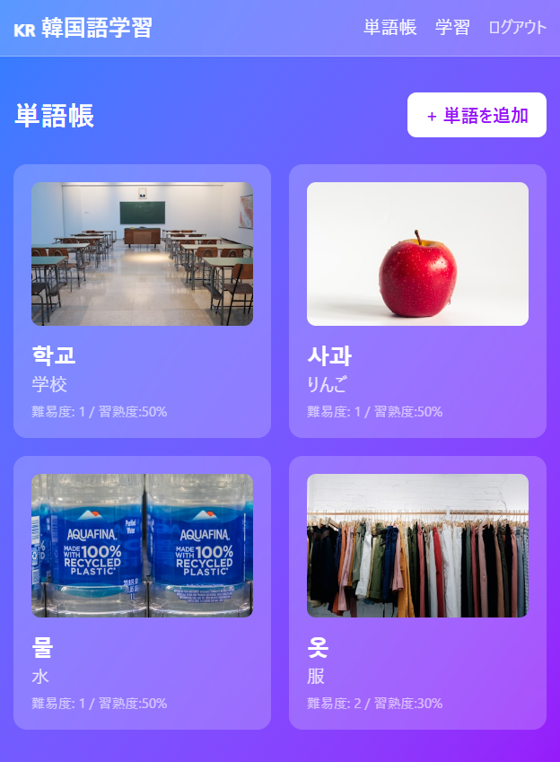
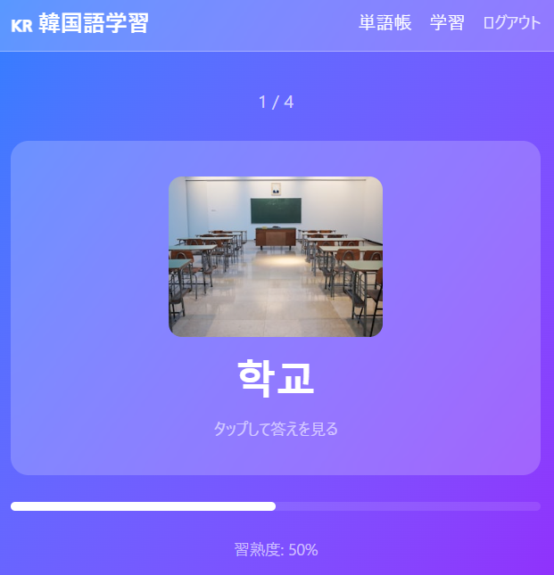
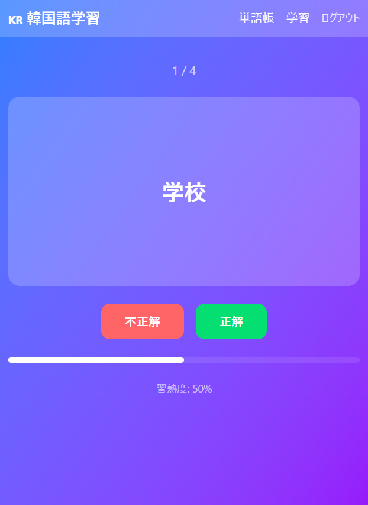

# Hanlog - 韓国語学習アプリ

韓国語の単語をフラッシュカード形式で学習できるWebアプリです。

## 機能

- ユーザー認証（登録・ログイン・ログアウト）
- 単語帳（韓国語・日本語訳・画像・難易度）
- Unsplash APIを使った画像検索・添付
- フラッシュカード学習（表：韓国語 → 裏：日本語訳）
- 習熟度の自動更新（正解+10 / 不正解-10）

## スクリーンショット

### ログイン


### 単語帳


### 単語追加


### フラッシュカード（表）


### フラッシュカード（裏）


## 技術スタック

| レイヤー | 技術 |
|---|---|
| フロントエンド | React 19 / TypeScript / Vite / Tailwind CSS |
| バックエンド | Ruby on Rails 7.2 (API mode) |
| データベース | PostgreSQL 16 |
| 認証 | JWT |
| インフラ | Docker / Docker Compose |

## セットアップ

### 必要なもの
- Docker / Docker Compose
- Node.js / pnpm

### 起動方法

**バックエンド・DB**
```bash
docker compose up db backend -d
docker compose exec backend bin/rails db:create db:migrate
```

**フロントエンド**
```bash
cd frontend
pnpm install
pnpm dev
```

### 環境変数

`frontend/.env` を作成して以下を設定してください：

```
VITE_API_BASE_URL=http://localhost:3000
VITE_UNSPLASH_ACCESS_KEY=your_unsplash_access_key
```

Unsplash API キーは [https://unsplash.com/developers](https://unsplash.com/developers) で取得できます。

## API エンドポイント

| Method | Path | 説明 |
|---|---|---|
| POST | `/api/v1/auth/signup` | ユーザー登録 |
| POST | `/api/v1/auth/login` | ログイン |
| DELETE | `/api/v1/auth/logout` | ログアウト |
| GET | `/api/v1/vocabularies` | 単語一覧 |
| POST | `/api/v1/vocabularies` | 単語追加 |
| PATCH | `/api/v1/vocabularies/:id` | 単語更新（習熟度含む） |
| DELETE | `/api/v1/vocabularies/:id` | 単語削除 |
